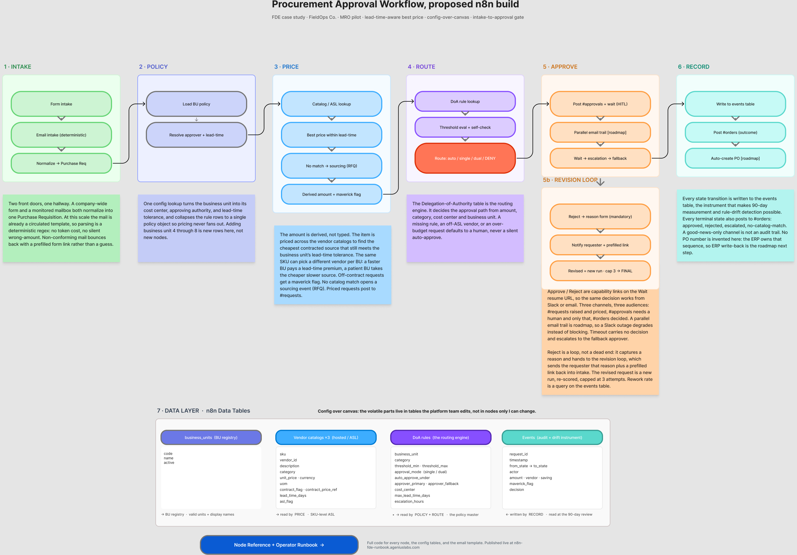

# Workflow architecture

FieldOps Co. procurement approval, automated in n8n. This is the system view: the
three workflows that make it up, what each does, how they relate, and what is on
the roadmap. For the node-by-node runbook, see [docs/WORKFLOW-REFERENCE.md](docs/WORKFLOW-REFERENCE.md).

## First Principle: Config over Canvas

One workflow shape, N business units. The units differ in their config **rows**,
not in their logic. A request is normalized, priced inside its unit's policy,
routed on the derived amount, gated by a human where the policy demands it, and
every transition is recorded. Moving a threshold, changing an approver, or
repricing a vendor is a table edit, never a workflow edit. Nobody has to open n8n
to run the business.

## The six-zone flow (production)

`INTAKE -> POLICY -> PRICE -> ROUTE -> APPROVE -> RECORD`

- **INTAKE** — a form or an email becomes one normalized request. Bad input (an
  unparseable quantity) refuses rather than guessing; a silent default reaches a
  purchase order.
- **POLICY** — load the unit's rules before pricing, because the lead-time
  tolerance decides which vendors are even eligible.
- **PRICE** — the amount is **derived** from the approved vendor catalog and is
  lead-time aware, never asserted by the requester. The cheapest source that can
  arrive in time wins; any premium paid for speed is reported, not hidden.
- **ROUTE** — the delegation-of-authority matrix is the routing engine:
  auto-approve, single, dual, or default-deny. A missing rule row denies to a
  human; it never auto-approves.
- **APPROVE** — one gate, three routes. The approval link is state-shaped and works
  from Slack or email, so a Slack outage never strands a request; the escalation
  timer still fires. Reject captures a mandatory reason and hands off to the Revision
  Loop; it is the start of a loop, not a dead end.
- **RECORD** — every terminal state writes one row to the audit log and posts the
  outcome. Rejections and escalations post too; a good-news-only channel is not an
  audit trail. Notifications go to Slack and, once an SMTP credential is set, to the
  requester and approver by email.



## The workflows

A dev/prod split with an evaluation harness, so a change can be proven before it
reaches production, plus the revision loop that runs alongside it.

### 1. Production — `workflows/fieldops-procure-to-approve.prod.json`

The live workflow. This is what runs against real requests.

### 2. DEV — `workflows/fieldops-procure-to-approve.dev.json`

A copy of production that you edit and test. It carries an **inert test hook**: a
request arriving with `_mode: test` returns the decision and short-circuits before
Slack, the approval wait, and the audit write, so a test run has no side effects
and leaves nothing to clean up. In normal use the hook never fires, so DEV stays a
true copy you can promote.

### 3. Regression Test Runner — `workflows/fieldops-regression-runner.json`

The evaluation harness. A form: pick a business unit (or ALL) and run. It sends the
golden set through DEV's **real decision logic**, asserts each request still routes
to the right place for the right amount, shows pass or fail on the result page, and
posts the findings to a **#regression** Slack channel so the team sees every run.

### 4. Revision Loop — `workflows/fieldops-revision-loop.json`

The reject, revise, re-approve loop, kept out of production so production stays
single-purpose. When an approver rejects, this workflow captures the reason and sends
the requester a pre-filled link back into intake; the revised request is a **new
production run**, re-priced and re-routed from scratch, capped at three attempts. It is
a runtime companion, not part of the promote loop above. Every pass links to its chain
root (`revision_of`), so rework rate and end-to-end case cycle time are queries against
`pr_events`. See [docs/WORKFLOW-REFERENCE.md](docs/WORKFLOW-REFERENCE.md) → "Zone:
REVISION LOOP" for the node reference and the terminate-and-link rationale.

### How they relate

```
edit DEV  ->  run the Runner  ->  green?  ->  promote DEV to production
                   |
              golden set (golden/) = the source of truth for "correct"
```

The golden set is the artifact the whole system rests on. It is 19 known requests
with known-correct outcomes, and it runs the workflow's own decision code, so it
cannot drift from what is deployed. See
[docs/WORKFLOW-REFERENCE.md](docs/WORKFLOW-REFERENCE.md) → "Evaluations" for the
case schema, how to add a case, and how to configure the runner.

## Why there is no LLM

The decision path is deterministic, so correctness here is a **test suite**, not a
model evaluation. "Green" on the canvas only means every node ran without throwing;
the golden set measures the thing green is supposed to mean, that each request
routed to the right place for the right amount. A spend-approval engine should be
auditable and repeatable, not probabilistic.

## Config lives in tables, not the canvas

Four tables carry everything that changes:

- **doa_rules** — thresholds, approvers, escalation windows, approval mode,
  lead-time tolerance. The routing engine.
- **vendor_catalog** — approved suppliers at the SKU level: who is approved for
  which item, at what price and lead time.
- **business_units** — the unit registry. Separate from the rules on purpose: a
  unit can exist before anyone has written its policy.
- **pr_events** — one row per request at its terminal state, with `submitted_at`,
  `decided_at`, `cycle_seconds`, and revision lineage (`revision_of`,
  `revision_count`). The measurement instrument; cycle time, stall rate, off-contract
  rate, and rework rate are all queries against it.

Onboarding a unit or moving a threshold is a row edit. See
[docs/WORKFLOW-REFERENCE.md](docs/WORKFLOW-REFERENCE.md) and [SETUP.md](SETUP.md).

## Roadmap

Deliberately not built in the pilot, and why:

- **ERP write-back and the PO number.** The ERP owns that sequence; a PO number
  that exists only here is a reconciliation problem. The workflow stops at "ready
  for PO."
- **The RFQ / three-quote sourcing event.** Detection of an unlisted item ships;
  the sourcing process itself is specified, not built.
- **A first-class Slack app with signed interactivity.** The pilot uses signed,
  single-use resume links (the same model as a password-reset link) because a Slack
  button cannot carry an auth cookie. A real Slack app is the hardening step.
- **Dedup enforcement.** `request_id` is deterministic and ready; a single audit-log
  lookup before routing closes it.
