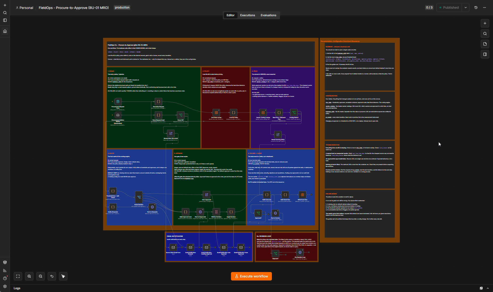
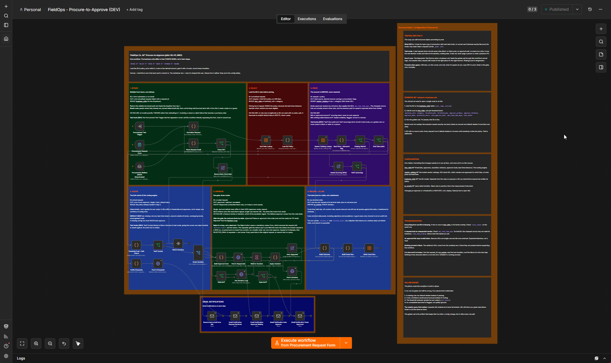
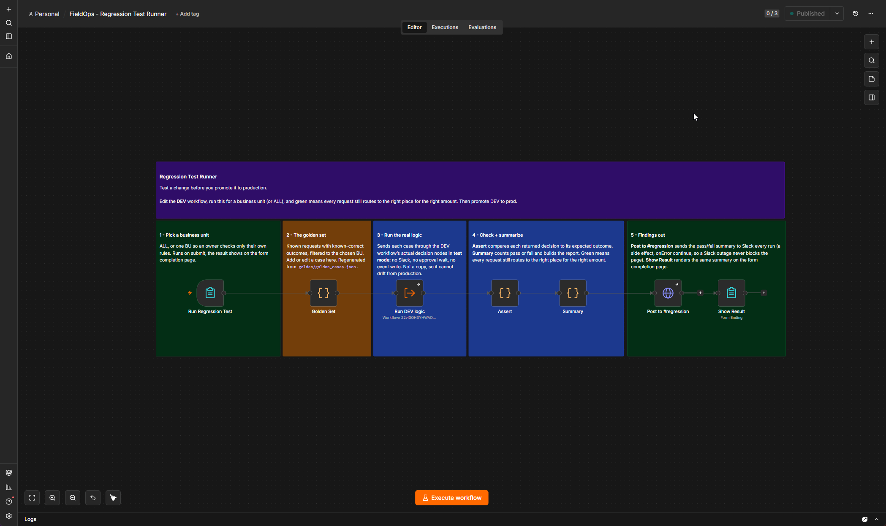
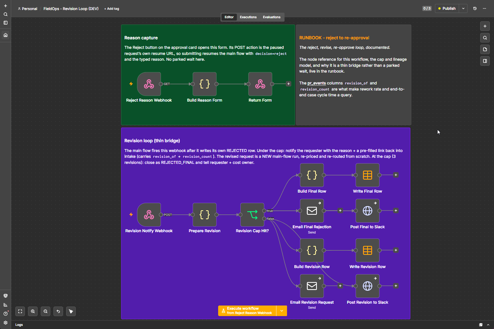

# FieldOps Co. Procurement: Workflow Breakdown

The visual companion to [WORKFLOW-ARCHITECTURE.md](WORKFLOW-ARCHITECTURE.md): the four
n8n workflows that make up the system, each shown on the canvas with what it does. For
the node-by-node runbook, see [docs/WORKFLOW-REFERENCE.md](docs/WORKFLOW-REFERENCE.md).

**The spine every workflow shares:**

- **n8n** is the orchestrator, and there are **no community nodes**, so this runs on n8n
  Cloud or self-hosted without change.
- **Four config Data Tables** carry everything that changes: `doa_rules` (thresholds,
  approvers, escalation windows, lead-time tolerance), `vendor_catalog` (approved
  suppliers at the SKU level), `business_units` (the unit registry), and `pr_events`
  (the audit log). The canvas is fixed; the business lives in the rows.
- **Two things are derived, never asserted.** The **amount** is computed from the vendor
  catalog, not typed by the requester. The **route** is computed from the policy table,
  and a missing or ambiguous rule **default-denies to a human**, never a silent approve.
- **No LLM on the decision path.** The routing is deterministic, so correctness is a test
  suite, not a model evaluation. A spend-approval engine should be auditable and
  repeatable.
- **Notifications** go to Slack, and to the requester and approvers by email once an SMTP
  credential is set.
- **`pr_events` is the measurement instrument.** Each request writes one outcome row with
  its route, derived amount, off-contract flag, savings, submission/decision timestamps, and
  revision lineage, so cycle time, stall rate, off-contract rate, and rework rate are queries
  against one table, not a separate reporting build.
- **A rejection starts a loop, not a terminal state.** Reject captures a reason and hands off
  to a separate Revision Loop workflow, which sends the requester the reason plus a pre-filled
  link back into intake. The revised request is re-priced and re-routed from scratch, capped at
  three attempts. Kept as its own workflow so production stays single-purpose.

---

## How the workflows connect

```
edit DEV  ->  run the Regression Runner  ->  green?  ->  promote DEV to Production
                     |
                golden set (golden/) = the source of truth for "correct"
```

A dev/prod split with an evaluation harness, so a change is proven before it reaches
production. The golden set is the artifact the whole system rests on: 19 known requests
with known-correct outcomes that run the workflow's own decision code, so it cannot drift
from what is deployed. The revision loop and the error poller run alongside this, not as
part of the promote loop.

---

## 1. Production: Procure-to-Approve (BU-01, MRO)

The live workflow. This is what runs against real requests. Six zones, left to right,
top row then bottom:

`INTAKE -> POLICY -> PRICE -> ROUTE -> APPROVE -> RECORD + CLOSE`

- **INTAKE** - a form or an email becomes one normalized request. An unparseable quantity
  THROWS instead of guessing.
- **POLICY** - load the unit's rules before pricing, because the lead-time tolerance
  decides which vendors are eligible.
- **PRICE** - the amount is derived from the approved catalog and is lead-time aware. Drop
  vendors over the tolerance, sort by unit price, pick the cheapest; if a cheaper vendor is
  dropped for being too slow, record the extra cost.
- **ROUTE** - the delegation-of-authority matrix is the routing engine: auto-approve,
  single, dual, or default-deny. A missing rule row denies to a human.
- **APPROVE** - one gate, three routes. The approval link is signed and works from Slack or
  email, so a Slack outage never strands a request; the escalation timer still fires.
- **RECORD + CLOSE** - every terminal state writes one row to the audit log and posts the
  outcome, over Slack and (once SMTP is set) email.

The right-hand column is the maintainer's documentation, configuration, and runbook,
carried on the canvas itself.



---

## 2. DEV: Procure-to-Approve (DEV)

A byte-for-byte copy of production that you edit and test. It carries **inert test
hooks**: an Execute Workflow Trigger entry, and a `_mode === 'test'` short-circuit (the
`Test?` gates that route to `Return Decision`) that returns the decision and stops before
Slack, the approval wait, and the audit write, so a test run has no side effects and
leaves nothing to clean up. In normal use the hooks never fire, so DEV stays a true copy
you can promote. It uses its own form path so it can run active alongside production.



---

## 3. Regression Test Runner

The evaluation harness. A form: pick a business unit (or ALL) and run. Five steps:

`Pick a business unit -> the golden set -> run DEV's real decision logic (test mode) -> assert -> findings out`

It sends the golden set through DEV's **actual decision nodes**, asserts each request
still routes to the right place for the right amount, renders the pass/fail summary on the
form completion page, and posts the findings to a **#regression** Slack channel every run.
Because it runs the deployed decision code rather than a copy, it cannot drift from
production.



---

## 4. Revision Loop: reject, revise, re-approve

What happens after an approver rejects. Kept as its **own workflow** so production stays
single-purpose (score a request, drive it to a decision) while rework lives on its own canvas
with its own trigger, actors, and metric. Two zones:

- **Reason capture** - the **Reject** button on the approval card opens a small form asking for
  a mandatory reason. The form's action is the paused request's own resume URL, so submitting
  resumes the main flow with `decision=reject` and the typed reason. No parked wait here.
- **Revision loop (thin bridge)** - the main flow fires this after it writes its own `REJECTED`
  row. Under the cap: notify the requester with the reason plus a **pre-filled link** back into
  intake (carrying `revision_of` + `revision_count`), and write a `REVISION_REQUESTED` audit row.
  At the cap (3 revisions): close as `REJECTED_FINAL` and tell the requester and the cost owner.

The revised request is a **new production run**, re-priced and re-routed from scratch, so a
smaller order can now auto-approve. Terminate-and-link, not park-and-resume: no execution hangs
waiting for a human edit, and the audit stays one clean terminal row per request, linked into a
chain. That chain is what makes rework rate and end-to-end case cycle time queries against
`pr_events`.



---

## 5. Global Error Poller: watch every workflow, alert on failure

An operational monitor that runs on its own schedule, separate from the request flow. Three
short zones:

- **Poll** - every 5 minutes a schedule fires and the workflow calls the n8n API for
  executions with `status=error`, authenticated with a dedicated key (`FDE_N8N_API`).
- **Dedup + enrich** - a Code node drops execution ids it has already reported (the first run
  after activation seeds silently and is bounded to the last 500 ids, so turning it on never
  floods the channel), then each new failure is enriched with its workflow name, failing node,
  and error message.
- **Notify** - the alert posts to an **#errors** Slack channel, and an email node carries the
  same alert. Email ships disabled until a mail server is set on the SMTP credential and
  `ERROR_NOTIFY_EMAIL` is set.

So if any workflow fails during the pilot or the 90-day window, the team hears about it
immediately instead of finding out when a request is stuck. The channel is a swap, not a
dependency: Slack is used because it was on hand, and the same alert ports to Teams, Google
Chat, WhatsApp, or any provider by changing the final send node.

---

The canvas documents itself: zoned sticky notes give orientation at a glance, and the
linked runbook carries the decisions. Values live in neither, because they live in the
config tables.
